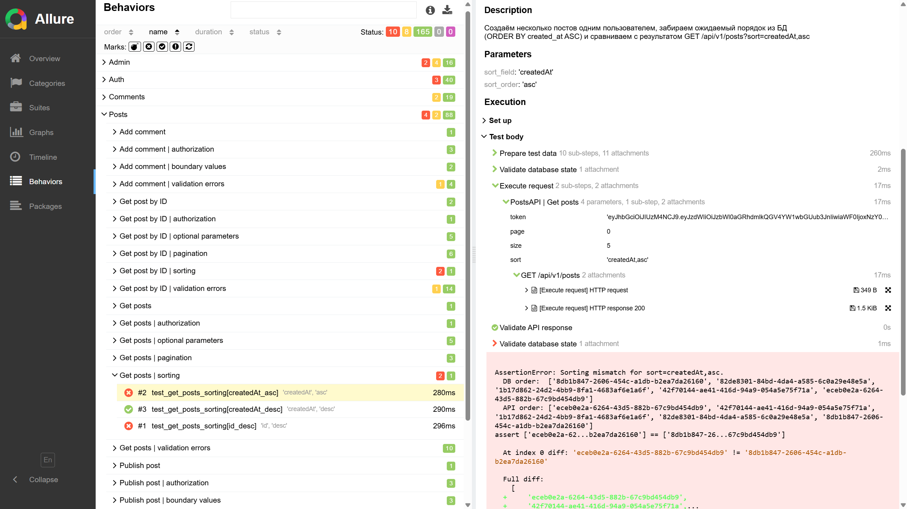

## Цель проекта

Автотесты покрывают основные сценарии NanoReddit API (аутентификация, посты, комментарии, профиль, админка), чтобы быстро обнаруживать регрессии и фиксировать нарушения контрактов между сервисами.

## Технологии

- Python 3.11+ и стандартная библиотека
- Pytest как тестовый раннер
- HTTP-клиенты на базе `httpx`
- Pydantic-схемы и `pydantic-settings` для моделей и конфигурации
- Faker и вспомогательные утилиты для генерации данных
- Allure для формирования отчётов
- `python-dotenv` и переменные окружения для секретов и конфигов

### Структура проекта

- **`tests/`**: сами тесты (`test_auth.py`, `test_posts.py`, `test_comments.py`, `test_profile.py`, `test_admin.py`).
- **`base/api/`**: обёртки над HTTP-запросами к различным частям API.
- **`models/requests` и `models/responses`**: модели запросов и ответов API.
- **`utils/`**: вспомогательный код (фикстуры, клиенты, ассершены, константы, генераторы данных).
- **`reports/`**: артефакты прогонов тестов (Allure-результаты, баг-репорты и т.п.).
- **`settings.py`**: базовые настройки проекта (урлы, креды и пр., если настроено).

### Установка и запуск

1. **Клонировать репозиторий**:

```bash
git clone https://github.com/maxdiksteinwork/nanoreddit-api-autotests.git
cd nanoreddit-api-autotests
```

2. **Создать и активировать виртуальное окружение (рекомендуется)**:

```bash
python -m venv venv
venv\Scripts\activate  # Windows
source venv/bin/activate  # Linux/MacOS
```

3. **Установить зависимости**:

```bash
pip install -r requirements.txt
```

4. **Запуск тестов**:

```bash
pytest
```

### Allure-отчёты

1. Запустить тесты с генерацией Allure-результатов (если не настроено в `pytest.ini`, пример):

```bash
pytest --alluredir=reports/allure-results
```

2. Сгенерировать и открыть отчёт:

```bash
allure serve reports/allure-results
```

**Скриншот отчёта**

